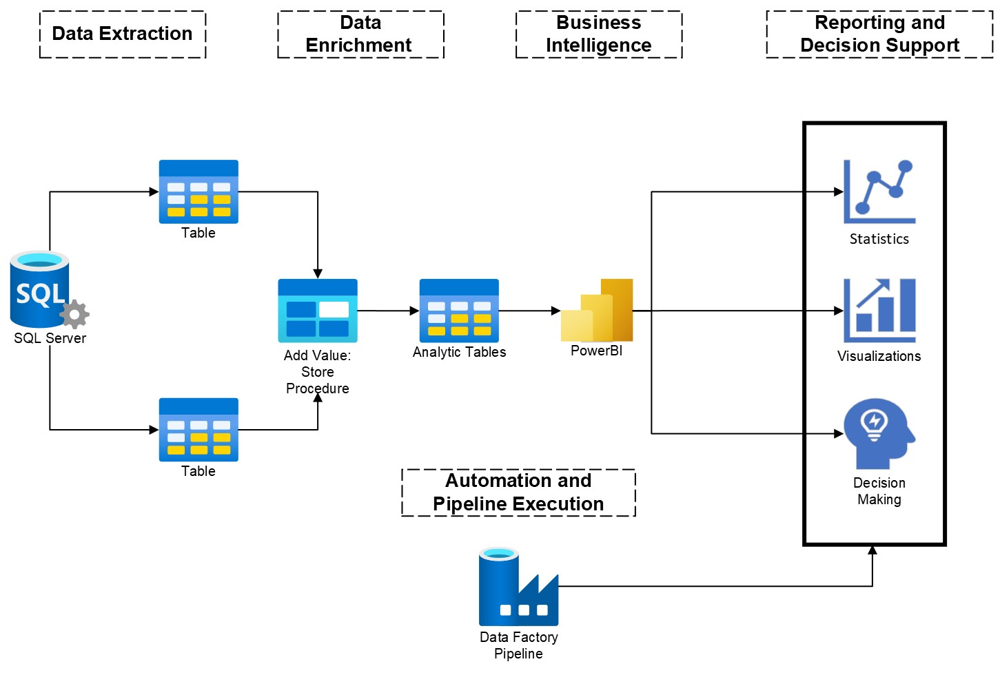

# Creating-an-Enterprise-Data-Model-in-PowerBI

## Project Overview
This enterprise data model project was designed to provide the finance team with the daily metrics needed for C-suite reporting and to empower the sales and operations departments in strategizing based on robust data analytics. It centralizes call data, sales performance, agent productivity, and media spend to offer a comprehensive view of business activities.

## Process Flow

## Repository Contents
Enterprise_Data_Model_Diagram.jpeg: Illustrates the data model's structure, showing how different data entities relate to one another.
Enterprise_Flow.pdf: Outlines the conceptual steps taken to build the data model from the initial data gathering to the final report creation.
Report_Data_Model.jpg: Displays the constructed Power BI data model, detailing the relationships and data flow used for reporting.
PowerBI_Enterprise_Report.pbit: Contains the complete Power BI report template, which includes the data model and predefined reports ready for enterprise analysis.
Media_Spend_Analysis_Report.pdf/jpg: Visual summaries that highlight media spending effectiveness across various channels.

## Data Model Build Process
Data Extraction: The process begins with extracting relevant datasets directly within Power BI from SQL Server, where raw data about calls, sales, and other pertinent information is stored.
Data Enrichment: Transformations are applied within Power BI to clean and structure the data, enriching it with calculated fields and measures to increase its business relevance.
Business Intelligence Modeling: A robust data model is created within Power BI, featuring complex relationships, hierarchies, and calculations tailored for advanced analytics.
Automation Workflow: The Azure Data Factory is used to manage and automate data refreshes, ensuring that the Power BI model remains current for daily reporting.
Enterprise Reporting: Power BI reports and dashboards are crafted to convey vital business metrics, supporting daily financial summaries and operational decision-making.
Strategic Insights: The model is leveraged by finance and operations teams to generate daily insights that influence C-suite discussions and drive sales strategies.

## Usage
The resources provided are optimized for high-level business intelligence tasks. Implement PowerBI_Enterprise_Report.pbit to analyze and generate reports. Refer to the visualizations in Media_Spend_Analysis_Report.pdf/jpg for insights on media investment returns.

## Conclusion
This data model serves as a critical instrument for finance and operations, underpinning daily reports to the C-suite and guiding sales strategies. By unifying various data streams into a single model, it illustrates an effective approach to corporate data management and analytics.

Please note: While the underlying SQL scripts and stored procedures are fundamental to the data preparation process, they are not included in this repository. Instead, the focus is on the Power BI implementation, which is used to translate the processed data into actionable insights for the finance and operations teams.
